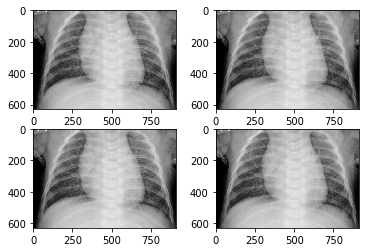

# Sample Data


```python
# Imports to view data
from glob import glob
import matplotlib.pyplot as plt
import matplotlib.image as mpimg
from numpy import floor
import random

print("Samples images for PNEUMONIA X-Rays")
path = 'D:/data/ChestXRay2017/chest_xray/train/PNEUMONIA/**'
path_contents = glob(path)
plt.figure(figsize=(16,16))
imgs = random.sample(path_contents, 4)
f, axarr = plt.subplots(2, 2)
axarr[0, 0].imshow(mpimg.imread(imgs[0]))
axarr[0, 1].imshow(mpimg.imread(imgs[0]))
axarr[1, 0].imshow(mpimg.imread(imgs[0]))
axarr[1, 1].imshow(mpimg.imread(imgs[0]))
```

    Samples images for PNEUMONIA X-Rays
    


    <matplotlib.image.AxesImage at 0x156e46b75c0>


    <Figure size 1152x1152 with 0 Axes>





# Data Preprocessing and Setup


```python
# Importing the Keras libraries and packages
from keras.models import Sequential
from keras.layers import Conv2D
from keras.layers import MaxPooling2D
from keras.layers import Flatten
from keras.layers import Dense

from keras.preprocessing.image import ImageDataGenerator

train_datagen = ImageDataGenerator(rescale = 1./255,
                                   shear_range = 0.2,
                                   zoom_range = 0.2,
                                   horizontal_flip = True)

test_datagen = ImageDataGenerator(rescale = 1./255)

train = train_datagen.flow_from_directory('D:/data/ChestXRay2017/chest_xray/train',
                                                 target_size = (64, 64),
                                                 batch_size = 32,
                                                 class_mode = 'binary')

test = test_datagen.flow_from_directory('D:/data/ChestXRay2017/chest_xray/test',
                                            target_size = (64, 64),
                                            batch_size = 32,
                                            class_mode = 'binary')
```

    Found 5232 images belonging to 2 classes.
    Found 624 images belonging to 2 classes.
    

# Initializing the CNN


```python
classifier = Sequential()

# Step 1 - Convolution
classifier.add(Conv2D(32, (3, 3), input_shape = (64, 64, 3), activation = 'relu'))

# Step 2 - Pooling
classifier.add(MaxPooling2D(pool_size = (2, 2)))

# Adding a second convolutional layer
classifier.add(Conv2D(32, (3, 3), activation = 'relu'))
classifier.add(MaxPooling2D(pool_size = (2, 2)))

# Step 3 - Flattening
classifier.add(Flatten())

# Step 4 - Full connection
classifier.add(Dense(units = 128, activation = 'relu'))
classifier.add(Dense(units = 1, activation = 'sigmoid'))

# Compiling the CNN
classifier.compile(optimizer = 'adam', loss = 'binary_crossentropy', metrics = ['accuracy'])
```

    WARNING:tensorflow:From C:\Users\Asjad\Anaconda3\lib\site-packages\tensorflow\python\framework\op_def_library.py:263: colocate_with (from tensorflow.python.framework.ops) is deprecated and will be removed in a future version.
    Instructions for updating:
    Colocations handled automatically by placer.
    

# Model Fitting


```python
classifier.fit_generator(train,
                         steps_per_epoch = 5216,
                         epochs = 10,
                         validation_data = test,
                         validation_steps = 624)
```

    WARNING:tensorflow:From C:\Users\Asjad\Anaconda3\lib\site-packages\tensorflow\python\ops\math_ops.py:3066: to_int32 (from tensorflow.python.ops.math_ops) is deprecated and will be removed in a future version.
    Instructions for updating:
    Use tf.cast instead.
    Epoch 1/10
    5216/5216 [==============================] - 5058s 970ms/step - loss: 0.1361 - acc: 0.9473 - val_loss: 0.2959 - val_acc: 0.9150
    Epoch 2/10
    5216/5216 [==============================] - 4735s 908ms/step - loss: 0.0702 - acc: 0.9740 - val_loss: 0.3144 - val_acc: 0.9041
    Epoch 3/10
    5216/5216 [==============================] - 4269s 818ms/step - loss: 0.0469 - acc: 0.9827 - val_loss: 0.3946 - val_acc: 0.9082
    Epoch 4/10
    5216/5216 [==============================] - 4344s 833ms/step - loss: 0.0319 - acc: 0.9883 - val_loss: 0.6945 - val_acc: 0.8782
    Epoch 5/10
    5216/5216 [==============================] - 5853s 1s/step - loss: 0.0228 - acc: 0.9915 - val_loss: 0.6644 - val_acc: 0.8910
    Epoch 6/10
    5216/5216 [==============================] - 6767s 1s/step - loss: 0.0179 - acc: 0.9938 - val_loss: 0.5829 - val_acc: 0.8944
    Epoch 7/10
    5216/5216 [==============================] - 6377s 1s/step - loss: 0.0148 - acc: 0.9948 - val_loss: 0.5871 - val_acc: 0.9018
    Epoch 8/10
    5216/5216 [==============================] - 6369s 1s/step - loss: 0.0132 - acc: 0.9953 - val_loss: 0.6021 - val_acc: 0.9039
    Epoch 9/10
    5216/5216 [==============================] - 4535s 869ms/step - loss: 0.0106 - acc: 0.9962 - val_loss: 0.7347 - val_acc: 0.8912
    Epoch 10/10
    5216/5216 [==============================] - 6207s 1s/step - loss: 0.0095 - acc: 0.9966 - val_loss: 0.4764 - val_acc: 0.9167
    


    <keras.callbacks.History at 0x156e46a8828>


# Prediction


```python
import numpy as np
from glob import glob
import random

from keras.preprocessing import image

print("Samples Prediction of PNEUMONIA X-Rays")
path = 'D:/data/ChestXRay2017/chest_xray/test/PNEUMONIA/**'
path_content = glob(path)
print(len(path_content))
print(path.split('/')[-2])
predctr = 0

for p in path_content:
#     img = random.sample(p, 1)
    

    test_image = image.load_img(p, target_size = (64, 64))
    test_image = image.img_to_array(test_image)
    test_image = np.expand_dims(test_image, axis = 0)
    result = classifier.predict(test_image)
    if result[0][0] == 1:
        prediction = 'PNEUMONIA'
        predctr +=1
    else:
        prediction = 'NORMAL'

print(f'''Accuracy = {predctr*100/len(path_content)}%''')
```

    Samples Prediction of PNEUMONIA X-Rays
    390
    PNEUMONIA
    Accuracy = 98.46153846153847%
    

# Evaluation


```python
model_json = classifier.to_json()
```


```python
with open("model.json", "w") as json_file:
    json_file.write(model_json)
# serialize weights to HDF5
classifier.save_weights("model.h5")
print("Saved model to disk")
```

    Saved model to disk
    

# Load Model


```python
# load json and create model
from keras.models import model_from_json
json_file = open('model.json', 'r')
loaded_model_json = json_file.read()
json_file.close()
loaded_model = model_from_json(loaded_model_json)
# load weights into new model
loaded_model.load_weights("model.h5")
print("Loaded model from disk")
 
# evaluate loaded model on test data
loaded_model.compile(optimizer = 'adam', loss = 'binary_crossentropy', metrics = ['accuracy'])

```

    Loaded model from disk
    


```python
import numpy as np
from glob import glob
import random

from keras.preprocessing import image

print("Samples Prediction of PNEUMONIA X-Rays")
path = 'D:/data/ChestXRay2017/chest_xray/test/PNEUMONIA/**'
path_content = glob(path)
print(len(path_content))
print(path.split('/')[-2])
predctr = 0

for p in path_content:
#     img = random.sample(p, 1)
    

    test_image = image.load_img(p, target_size = (64, 64))
    test_image = image.img_to_array(test_image)
    test_image = np.expand_dims(test_image, axis = 0)
    result = loaded_model.predict(test_image)
    if result[0][0] == 1:
        prediction = 'PNEUMONIA'
        predctr +=1
    else:
        prediction = 'NORMAL'

print(f'''Accuracy = {predctr*100/len(path_content)}%''')
```

    Samples Prediction of PNEUMONIA X-Rays
    390
    PNEUMONIA
    Accuracy = 98.46153846153847%
    


```python

```
